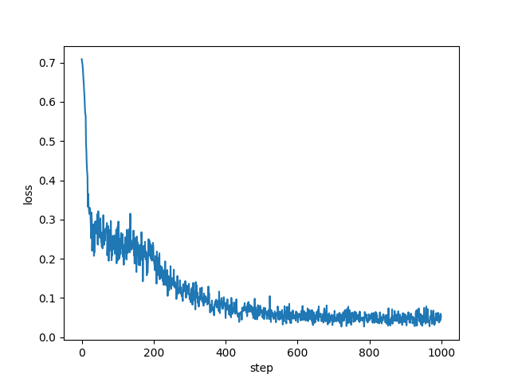
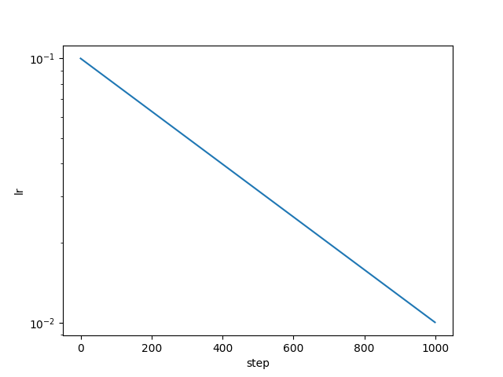

# Flambeau

My attempt to built ML framework with autograd which imitates [PyTorch's](http://pytorch.org) interface

Why? Just as a proof of concept, also to practice some coding. Flambeau is built on top of [NumPy](http://www.numpy.org) and doesn't have any GPU support (at least for now).

[Example](./example.py) of nonlinear optimization: binary classification on "Two Moons" dataset.

